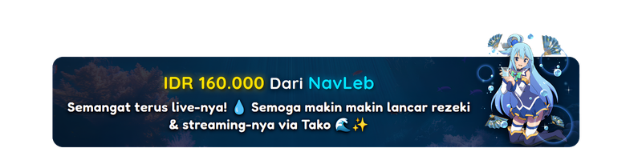

# 🎌 Custom Alert Overlay for Tako

Koleksi template Custom Alert Overlay interaktif dan estetik untuk platform streaming **Tako**.
Dirancang khusus agar pas di layar OBS Studio dan mudah dibaca oleh penonton!

---

## 📑 Daftar Isi

- [💡 Request Karakter & Kontribusi](#-request-karakter--kontribusi)
- [🖼️ Galeri Preview Overlay](#️-galeri-preview-overlay)
- [🚀 Cara Pemasangan di Tako](#-cara-pemasangan-di-tako)
- [⚙️ Cara Kustomisasi](#️-cara-kustomisasi)
- [☕ Support](#-support)
- [📄 Lisensi](#-lisensi)

---

## 💡 Request Karakter & Kontribusi

Punya ide karakter anime favorit untuk dijadikan tema overlay berikutnya? Kamu bisa mengajukannya melalui **[Pull Request](https://github.com/shiroinekoo/Tako-Overlay/pulls)**.

---

## 🖼️ Galeri Preview Overlay

Berikut adalah beberapa pilihan template overlay anime yang sudah tersedia dan siap pakai:

<table>
  <tr>
    <td align="center" width="50%">
      
       
      <b><a href="./template/mikasa_chibi">Mikasa Ackerman</a></b>
    </td>
    <td align="center" width="50%">
      
       
      <b><a href="./template/marin_chibi">Marin Kitagawa</a></b>
    </td>
  </tr>
  <tr>
    <td align="center" width="50%">
      
       
      <b><a href="./template/emilia satella">Emilia Satella</a></b>
    </td>
    <td align="center" width="50%">
      
       
      <b><a href="./template/aqua">Aqua</a></b>
    </td>
  </tr>
</table>

---

## 🚀 Cara Pemasangan di Tako

Ikuti langkah-langkah mudah di bawah ini untuk memasang template ke OBS Studio:

1. **Pilih Template:** Masuk ke folder [`template`](./template) overlay pilihanmu di repositori ini.
2. **Salin Code:** Buka file `index.html` dari template tersebut, lalu salin seluruh isi kodenya.
3. **Masukkan ke Tako:** Buka dashboard [**Tako**](https://tako.id/c/NavLeb/overlay/alert) kamu, masuk ke bagian **Alert -> Custom HTML CSS**, lalu *paste* kode yang sudah disalin ke dalam editor.
4. **Pasang di OBS:** Salin URL Widget dari Tako, lalu tambahkan ke OBS Studio sebagai **Browser Source**. Atur ukuran properti *width* dan *height* sesuai kebutuhan stream kamu.

---

## ⚙️ Cara Kustomisasi

Kamu bisa menyesuaikan tampilan overlay dengan mudah langsung di dalam kode HTML/CSS:

* **Ukuran Font:** Ubah nilai pada properti `font-size` di bagian `.text` atau `.message`.
* **Warna Font:** Sesuaikan variabel warna di bagian `:root` (seperti `--jacket-brown` atau `--scarf-red`) dengan kode warna HEX pilihanmu.
* **Jenis Font:** Ubah tautan `@font-face` atau nama properti `font-family` sesuai selera.

---

## ☕ Support

Suka dengan template-template ini dan ingin mendukung pengembangan proyek agar terus update? Kamu bisa memberikan dukungan melalui traktir kopi atau donasi di bawah ini:

* **Link Donasi:** [Klik di sini untuk Donasi](https://saweria.co/shiroinekoo)
* **Scan QRIS:** *(akan ditambahkan segera)*

---

## 📄 Lisensi

Proyek ini bersifat *open-source* dan bebas digunakan oleh siapa saja untuk keperluan live streaming di bawah [Lisensi MIT](./LICENSE). Silakan gunakan, modifikasi, dan bagikan ulang!
